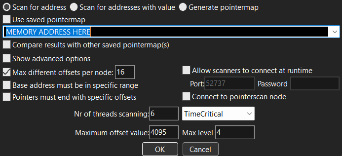
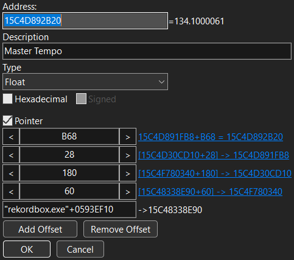

# Putzbox Link
Small tool for synchronizing Rekordbox and VJ hardware via OSC on Putz, MIT's best dorm floor.

## What does it do?
When run on the same computer as an instance of Rekordbox, it will read the current timing information and broadcast it over [OSC](https://en.wikipedia.org/wiki/Open_Sound_Control). By default it targets port 6669 on Computzer, but it can be configured to target other devices.

The program does not interact with the audio stream in any way, but reads the onscreen text values through memory. It is therefore extremely accurate, although your beatgrid must be correct for it to work as expected.

This program broadcasts the number of bars into the song that you are.
> NOTE: If you have enabled "Count to the next MEMORY CUE" in your Rekordbox settings like I have, you must actually have memory cues in your song in order to get beat information. If you don't know what this means, don't worry about it.

## Usage
`rkbx_osc.exe [flags]`
where
``` 
 -h  Print help and available versions
 -u  Fetch latest offset list from GitHub and exit
 -v  Rekordbox version to target, eg. 6.7.3

-- OSC --
 -s  Source address, eg. 127.0.0.1:1337
 -t  Target address, eg. 192.168.1.56:6667
```
If no arguments are given, it targets computzer (192.168.2.249:6669). Because messages are sent with UDP, source address should not need to be set.

This probably goes without saying, but make sure that you are on the same network as computzer. MIT SECURE / MIT GUEST / MIT will not work! You must be connected to the same router as computzer, either by way of ethernet or joining the "halonet" network.

Please note that at the current moment the halonet network has no internet, so if you'd like to be able to access the internet while DJing, it's recommended that you use an ethernet connection.
At time of writing there is a USB-C hub that can connect your laptop to the GRV6 and also the correct network via ethernet.

| Supported Rekordbox Version  |
| ----- |
| `7.1.5`, `7.1.4` |


## OSC Addresses
 - `/beat`: the current beat fraction, as a float counting from 0 to 1
 - `/bar`: the current bar fraction, as a float counting from 0 to 1
 - `/bpm`: the master deck tempo in BPM

## How it works
The timing information is extracted through reading Rekordbox's memory. The program reads the current beat and measure from the text display on top of the large waveform, and detects when these change.
When a change occurs, the beat fraction is set to 0 and then counts linearly upwards at a pace dictated by the master track BPM.

## Limitations
- Assumes 4/4 time signature - Rekordbox does not support anything else without manually editing the database
- Windows only

# Technical Details

## Offsets file format
The `offsets` file contain the hex memory addresses (without the leading 0x) for the values we need to fetch. The file supports basic comments (# at start of line). Versions are separated by two newlines.

Example entry with explanations:
```
# EXAMPLE ENTRY
# 7.1.5                     Rekordbox Version
# 05781FC0 8 8 198 2470     Deck 1 Bar
# 05781FC0 8 8 198 2474     Deck 1 Beat
# 05781FC0 8 10 198 2470    Deck 2 Bar
# 05781FC0 8 10 198 2474    Deck 2 Beat
# 05781FC0 8 18 198 2470    Deck 3 Bar
# 05781FC0 8 18 198 2474    Deck 3 Beat
# 05781FC0 8 20 198 2470    Deck 4 Bar
# 05781FC0 8 20 198 2474    Deck 4 Beat
# 0593EF10 60 180 28 B68    Masterdeck BPM
# 0591A080 8 38 1200        Masterdeck Index
```

## Updating
Updating to new Rekordbox versions is a major pain. It is advised that you don't install new Rekordbox versions until this software supports it. If that's taking a while go yell at James (me).

In case James is dead or cruft, here's the rough process for updating this software to support new rekordbox versions.

---

Between versions, the only thing that changes are the memory offsets in the offsets file. You will need to use Cheat Engine to detect the new offsets and record them. Below are the steps to find the offsets for the master BPM as an example.

### Using Cheat Engine:
1. Launch Rekordbox and select that process in Cheat Engine
2. Load tracks onto decks 1 and 2
3. Perform a First scan for the value of the BPM on the master deck. The master BPM datatype is Float.
4. Change the value of the BPM on the master deck and perform another scan
5. Make the other deck the master deck and scan for that BPM. At this point, there should only be one or two memory addresses left in the cheat engine table. Double click it to add it to your list of tracked values.
6. Go to Memory View -> Tools -> Pointer Scan -> Pointer Scanner -> Scan for Pointer.
7. Perform a pointer scan with the following settings:



(Note that the Nr of threads scanning will be different depending on your CPU specs)

8. Save that pointerlist as MasterBPM.PTR or something, just in case you fuck up a later step and want to come back to this part.
9. With Cheat Engine open, restart Rekordbox. Once it has relaunched, select the Rekordbox Process in Cheat Engine again like you did in step 1. Load another track and set the master deck.
10. Now go to Pointer Scanner -> Rescan Memory and perform a scan with the following settings:


11. You now have a list of pointers that will track Rekordbox Master Tempo across a restart. Double click one of those with a short offset list to add it to your list of tracked pointers.
> NOTE: A short offset list means that it has only 3 or 4 offsets, which are relatively low numbers. The shorter the better.
12. Repeat this process for the Beats and Bars of decks 1, 2, 3, and 4, as well as the index of the master deck.
13. Once you have your list of every necessary pointer, double click on the "Address" field in your list of tracked pointers to pull up a pane of information about the pointer that looks like this:



14. Record this information in the offsets file in the following format:
`0593EF10 60 180 28 B68`

### Notes about specific pointers:

### `master_bpm`
A float representing the current master BPM. Should be the easiest to find.

### `masterdeck_index`
A byte representing which deck is the master. Probably the most difficult pointer to find, because there are 8 or 9 memory addresses that track this value and not all of them can be used to find pointers that persist after restart. It might take multiple attempts.

It's recommended that you put Rekordbox into four deck mode for this one, just so you have more options to narrow down addresses in your search. The value of this byte is 0 for deck 1, 1 for deck 2, 2 for deck 3, and 3 for deck 4 as master.

### `deck1, deck2..., bar, beat`
To find these values, position the playhead on a particular point in a song and then scan for the bar or beat displayed by the blue number at the top of the waveform.
> NOTE: As mentioned earlier, if you have configured Rekordbox to display the number of bars before the next memory cue, you will be searching for the number of bars remaining before the next memory cue, NOT the number of bars you have progressed into the song. The blue number is always the value that you're looking for.

This should be obvious but the value to the left of the decimal is the bar and the value to the right is the beat.

One other thing to note about the structure of the offset chains for these pointers:

```
# 05781FC0 8 8 198 2470     Deck 1 Bar
# 05781FC0 8 8 198 2474     Deck 1 Beat
# 05781FC0 8 10 198 2470    Deck 2 Bar
# 05781FC0 8 10 198 2474    Deck 2 Beat
# 05781FC0 8 18 198 2470    Deck 3 Bar
# 05781FC0 8 18 198 2474    Deck 3 Beat
# 05781FC0 8 20 198 2470    Deck 4 Bar
# 05781FC0 8 20 198 2474    Deck 4 Beat
```
They're all very similar. They always have the same first hexadecimal number (05781FC0 in this case) and the same first offset.
The second offset determines the index of the deck. In the above example, 8 is deck 1, 10 is deck 2, etc. The third offset is always the same, and the fourth offset determines if it is the Bar or Beat.
If you're smart about this, you can save a lot of time by inferring the offset chains of some of the pointers, so you don't have to search for all 8 of them.

One other thing to note is that it hasn't always been the case that offsets 1 and 3 are the same between all pointers. It used to be that 1 and 2 were the same between all pointers and then offset 3 indicated the deck number, back before Rekordbox 7.1.0. So be wary that it could change in the future.

---
Reach out to James if you have any questions. I've tried to make the operation of this software as drop-in as possible so that it can still be used after I graduate. If this system is still in use by then, firstly I'm impressed, and secondly, feel free to shoot me a signal DM with any questions.
